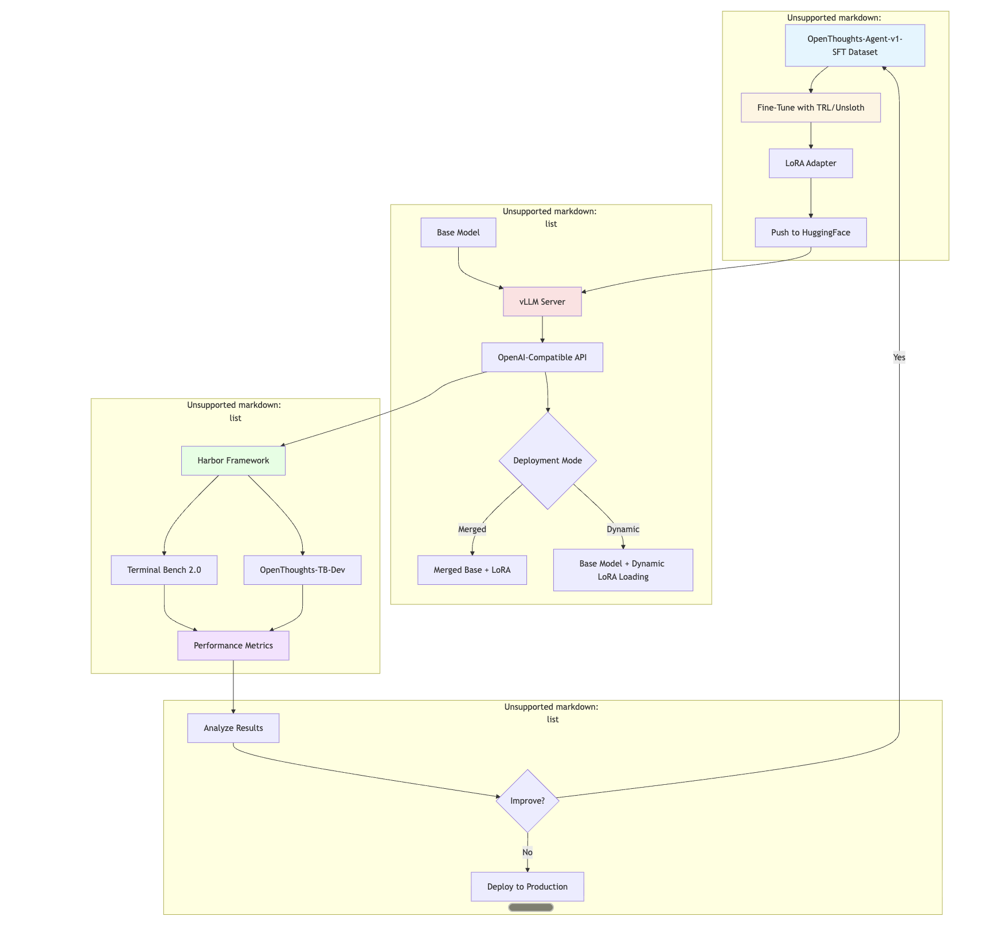

# Benchmark SLMs for Agentic Tasks: Fine-Tuning and Enhanced Inference via vLLM

A comprehensive framework for fine-tuning Small Language Models (SLMs) on agentic tasks and benchmarking them using state-of-the-art evaluation suites. This repository demonstrates the complete workflow from supervised fine-tuning (SFT) with LoRA adapters to deployment with vLLM and evaluation on OpenThoughts and Terminal Bench 2.0.

## Overview

This project provides an end-to-end pipeline for:
- **Serving**: Deploy any vLLM-compatible model with inference containers
- **Fine-Tuning**: Train models using TRL and Unsloth frameworks with LoRA adapters
- **Benchmarking**: Evaluate models on OpenThoughts and Terminal Bench 2.0
- **Dynamic Deployment**: Utilize LoRA adapters dynamically during inference without restarting servers

### Key Features

- Support for any vLLM-compatible model (Mistral, Devstral, Llama, Qwen, etc.)
- Efficient LoRA-based fine-tuning on agentic task datasets
- OpenAI-compatible API serving with dynamic LoRA adapter loading
- Comprehensive benchmarking on terminal and software engineering tasks
- Complete workflow from training to deployment to evaluation

## Architecture



## Table of Contents

- [Quick Start](#quick-start)
- [1. Model Serving](#1-model-serving)
  - [Inference with vLLM](#inference-with-vllm)
  - [Dynamic LoRA Adapter Loading](#dynamic-lora-adapter-loading)
- [2. Benchmarking](#2-benchmarking)
  - [OpenThoughts Benchmark](#openthoughts-benchmark)
  - [Terminal Bench 2.0](#terminal-bench-20)
- [3. Supervised Fine-Tuning (SFT)](#3-supervised-fine-tuning-sft)
  - [Training with TRL](#training-with-trl)
  - [Training with Unsloth](#training-with-unsloth)
  - [Fine-Tuning on OpenThoughts-SFT](#fine-tuning-on-openthoughts-sft)
- [4. LoRA Workflow](#4-lora-workflow)
  - [Training LoRA Adapters](#training-lora-adapters)
  - [Merging and Pushing to HuggingFace](#merging-and-pushing-to-huggingface)
  - [Dynamic Serving](#dynamic-serving)
- [Example: Devstral Fine-Tuning Workflow](#example-devstral-fine-tuning-workflow)
- [Resources](#resources)
- [Requirements](#requirements)
- [License](#license)

---

## Quick Start

### Prerequisites

```bash
# Install core dependencies
pip install vllm harbor-ai torch transformers

# Clone the repository
git clone https://github.com/your-org/benchmark-agentic-SLMs.git
cd benchmark-agentic-SLMs
```

### 3-Step Workflow

**1. Serve a Model**
```bash
cd serve/vLLM
# Configure your model in config.yaml
python serve.py
# Server starts at http://localhost:8000
```

**2. Run Benchmarks**
```bash
cd ../../benchmarks/terminal_bench
./run_benchmark_lora.sh
```

**3. Fine-Tune & Improve**
```bash
cd ../../SFT-recipes/trl
# Configure training in train.yaml
./train_multi_gpu.sh
```

---

## 1. Model Serving

### Inference with vLLM

This repository uses vLLM for high-performance model serving with OpenAI-compatible APIs. vLLM provides:
- Fast inference with PagedAttention
- Continuous batching for high throughput
- Efficient memory management
- Support for quantization (FP8, AWQ, GPTQ)
- Dynamic LoRA adapter loading

**Getting Started:**
```bash
cd serve/vLLM
python serve.py
```

The server provides:
- **Chat Completions**: `/v1/chat/completions`
- **Completions**: `/v1/completions`
- **Models**: `/v1/models`
- **Interactive Docs**: `http://localhost:8000/docs`

**Example Request:**
```python
from openai import OpenAI

client = OpenAI(
    base_url="http://localhost:8000/v1",
    api_key="dummy"
)

response = client.chat.completions.create(
    model="mistralai/Devstral-Small-2-24B-Instruct-2512",
    messages=[
        {"role": "user", "content": "Write a bash script to process logs"}
    ],
    max_tokens=512
)
```

**Supported Models:**
- Mistral family (Mistral-7B, Devstral, Codestral)
- NVIDIA Nemotron series
- Llama 2/3/3.1
- Qwen/Qwen2
- Any vLLM-compatible model ([full list](https://docs.vllm.ai/en/latest/models/supported_models.html))

**Configuration:**
Configure models in [`serve/vLLM/config.yaml`](serve/vLLM/config.yaml)

**Detailed Documentation:** [Serving Guide](serve/SERVE_GUIDE.md)

### Dynamic LoRA Adapter Loading

vLLM supports loading multiple LoRA adapters without restarting the server:

**Enable Dynamic Loading:**
```bash
export VLLM_ALLOW_RUNTIME_LORA_UPDATING=True
python serve.py
```

**Load Adapter at Runtime:**
```bash
curl -X POST http://localhost:8000/v1/load_lora_adapter \
  -H "Content-Type: application/json" \
  -d '{
    "lora_name": "my-adapter",
    "lora_path": "username/adapter-repo"
  }'
```

**Use the Adapter:**
```python
response = client.chat.completions.create(
    model="my-adapter",  # Specify adapter name
    messages=[{"role": "user", "content": "Hello!"}]
)
```

This enables:
- A/B testing between adapters
- Multi-tenant serving with different adapters per user
- Rapid experimentation without server restarts

---

## 2. Benchmarking

### OpenThoughts Benchmark

[OpenThoughts](https://www.openthoughts.ai) is a community-driven initiative for creating high-quality datasets and benchmarks for agentic AI systems. This repository includes OpenThoughts-TB-Dev, a 70-task benchmark designed to evaluate model performance on terminal-based agentic tasks.

**What is OpenThoughts?**
- Open-source post-training datasets for reasoning
- Collaborative research from Stanford, UC Berkeley, NYU, and others
- Focus on agentic capabilities and software engineering tasks
- Live leaderboard tracking 300+ models

**Dataset Used:**
- **OpenThoughts-TB-Dev**: 70 terminal-based tasks
- **Purpose**: Evaluate autonomous task completion in shell environments
- **Dataset**: [open-thoughts/OpenThoughts-TB-dev](https://huggingface.co/datasets/open-thoughts/OpenThoughts-TB-dev)

**Running the Benchmark:**
```bash
cd benchmarks/openthoughts
./benchmark_openthoughts.sh
```

The script:
1. Downloads the OpenThoughts-TB-dev dataset
2. Installs Harbor CLI
3. Configures your model as an external agent
4. Runs the benchmark suite
5. Saves results to `./benchmark_results/`

**Evaluation Framework:**
Uses [Harbor](https://github.com/harbor-ai/harbor) for standardized task execution:
- Dockerized execution environments
- Instruction-environment-verifier triplets
- Automated result collection

**Expected Metrics:**
- Task success rate
- Reasoning quality scores
- Command execution accuracy
- Multi-turn interaction effectiveness

**Detailed Documentation:** [Benchmark Guide](benchmarks/BENCHMARK_GUIDE.md)

### Terminal Bench 2.0

[Terminal Bench 2.0](https://huggingface.co/datasets/alexgshaw/terminal-bench-2-leaderboard) is a comprehensive benchmark suite for evaluating AI agents' capabilities in terminal-based and shell command environments.

**What is Terminal Bench 2.0?**
- Frontier-level benchmark for terminal task evaluation
- Tests command-line proficiency and autonomous problem-solving
- Calibrated for state-of-the-art models
- Official leaderboard for community comparison

**Key Features:**
- Dockerized sandbox environments
- Multi-turn interaction support
- Real-world software engineering scenarios
- Objective automated verification

**Running the Benchmark:**
```bash
cd benchmarks/terminal_bench
./benchmark_terminalbench.sh
```

**With LoRA Adapter:**
```bash
./run_benchmark_lora.sh
```

**Benchmark Configuration:**
```yaml
# benchmarks/terminal_bench/config.yaml
model_information:
  model_config:
    model_id: "mistralai/Devstral-Small-2-24B-Instruct-2512"
  vllm_engine_config:
    enable_lora: true
    lora_modules:
      devstral-sft: "Madhurprash/Devstral-Small-2-24B-Instruct-2512-SFT-LoRA-OpenThoughts"
```

**Performance Improvements:**
Models fine-tuned on OpenThoughts-SFT show significant gains:
- **Baseline (pre-training only)**: ~0.7%
- **After OpenThoughts-SFT**: 15.7%
- **22x improvement** demonstrates effectiveness of SFT on agentic tasks

**Leaderboard:** [Terminal Bench 2.0 Results](https://huggingface.co/datasets/alexgshaw/terminal-bench-2-leaderboard)

---

## 3. Supervised Fine-Tuning (SFT)

### Training with TRL

[TRL (Transformer Reinforcement Learning)](https://github.com/huggingface/trl) is HuggingFace's library for training language models with reinforcement learning, including supervised fine-tuning.

**Features:**
- Efficient LoRA/QLoRA training
- Integration with HuggingFace ecosystem
- Support for large models on limited hardware
- Comprehensive logging and checkpointing

**Training Setup:**
```bash
cd SFT-recipes/trl

# Configure training parameters
vim train.yaml

# Single-GPU training
python train_sft.py

# Multi-GPU training (recommended)
./train_multi_gpu.sh
```

**Training Configuration:**
```yaml
# SFT-recipes/trl/train.yaml
model:
  name: "mistralai/Devstral-Small-2-24B-Instruct-2512"
  quantization: "4bit"  # For memory efficiency

dataset:
  name: "open-thoughts/OpenThoughts-Agent-v1-SFT"
  split: "train"

training:
  output_dir: "./outputs/devstral-sft"
  num_train_epochs: 7
  learning_rate: 4e-5
  per_device_train_batch_size: 1
  gradient_accumulation_steps: 16

lora:
  r: 16  # LoRA rank
  lora_alpha: 32
  target_modules: ["q_proj", "k_proj", "v_proj", "o_proj"]
```

**Multi-GPU Training:**
```bash
# Automatic detection of available GPUs
./train_multi_gpu.sh
```

**Detailed Documentation:** [SFT Guide - TRL Section](SFT-recipes/trl/SFT_GUIDE.md)

### Training with Unsloth

[Unsloth](https://github.com/unslothai/unsloth) provides optimized training for LLMs with 2x faster training and 80% less memory usage.

**Features:**
- 2x faster training than standard implementations
- 80% memory reduction through optimizations
- Native support for LoRA and QLoRA
- Seamless integration with HuggingFace

**Training Setup:**
```bash
cd SFT-recipes/unsloth

# Configure and train
vim train.yaml
./train_multi_gpu.sh
```

**When to Use Unsloth:**
- Limited GPU memory
- Faster iteration cycles needed
- Training very large models on consumer hardware
- Cost optimization for cloud training

### Fine-Tuning on OpenThoughts-SFT

The [OpenThoughts-Agent-v1-SFT](https://huggingface.co/datasets/open-thoughts/OpenThoughts-Agent-v1-SFT) dataset contains 15,209 high-quality training traces for agentic behavior.

**Dataset Characteristics:**
- **Size**: 15,209 examples (~110 MB)
- **Task Types**: Terminal commands, bug fixing, software engineering
- **Format**: Conversational traces with multi-turn interactions
- **Source**: nl2bash and InferredBugs datasets

**Training Process:**
1. **Load Dataset**: Automatically downloaded via HuggingFace Datasets
2. **Configure Model**: Specify base model and LoRA parameters
3. **Train**: Run SFT with TRL or Unsloth
4. **Validate**: Monitor loss convergence and validation metrics

**Expected Training Time:**
- **Single GPU (A100)**: ~12-16 hours for 7 epochs
- **8x GPU (A100)**: ~2-3 hours for 7 epochs
- **Devstral-24B model**: ~3 hours on 8x A100 GPUs

**Post-Training:**
After fine-tuning on OpenThoughts-SFT, models show:
- Improved task completion rates on Terminal Bench 2.0
- Better command understanding and generation
- Enhanced multi-turn reasoning capabilities
- Stronger performance on software engineering benchmarks

---

## 4. LoRA Workflow

### Training LoRA Adapters

LoRA (Low-Rank Adaptation) enables efficient fine-tuning by training only a small set of parameters:

**Advantages:**
- **Memory Efficient**: Train 24B models on 24GB GPUs
- **Fast Training**: Fewer parameters to update
- **Portable**: Adapters are small (typically 50-200 MB vs. 50+ GB for full models)
- **Composable**: Can load/unload multiple adapters dynamically

**Training Configuration:**
```yaml
lora:
  r: 16  # Rank (controls adapter size)
  lora_alpha: 32  # Scaling factor
  lora_dropout: 0.05
  target_modules:  # Which layers to adapt
    - q_proj
    - k_proj
    - v_proj
    - o_proj
  bias: "none"
```

**Training Command:**
```bash
cd SFT-recipes/trl
./train_multi_gpu.sh
```

**Output:**
- LoRA adapter saved to `./outputs/devstral-sft/`
- Contains: `adapter_model.safetensors`, `adapter_config.json`
- Size: ~150 MB (vs. ~50 GB for full model)

### Merging and Pushing to HuggingFace

After training, you can merge the LoRA adapter with the base model or push it separately.

**Option 1: Push LoRA Adapter Only (Recommended)**
```bash
cd SFT-recipes/trl

python push_to_hf.py \
  --hf-repo-id "your-username/model-name-LoRA" \
  --mode adapter \
  --adapter-path "./outputs/devstral-sft" \
  --hf-token "your_hf_token"
```

**Benefits:**
- Small upload size (~150 MB)
- Users can apply to any version of base model
- Easy to version and iterate

**Option 2: Merge Then Push Full Model**
```bash
# Merge LoRA with base model
python merge_lora.py \
  --base-model "mistralai/Devstral-Small-2-24B-Instruct-2512" \
  --adapter-path "./outputs/devstral-sft" \
  --output-path "./outputs/merged-devstral"

# Push merged model
python push_to_hf.py \
  --hf-repo-id "your-username/model-name-merged" \
  --mode existing \
  --model-path "./outputs/merged-devstral" \
  --hf-token "your_hf_token"
```

**Benefits:**
- Single model file for deployment
- No runtime adapter loading overhead
- Simpler deployment for end users

**Example:**
Our Devstral adapter is available at:
[Madhurprash/Devstral-Small-2-24B-Instruct-2512-SFT-LoRA-OpenThoughts](https://huggingface.co/Madhurprash/Devstral-Small-2-24B-Instruct-2512-SFT-LoRA-OpenThoughts)

### Dynamic Serving

Once LoRA adapters are pushed to HuggingFace, they can be loaded dynamically during serving:

**Configure vLLM:**
```yaml
# serve/vLLM/config.yaml
vllm_engine_config:
  enable_lora: true
  lora_modules:
    devstral-sft: "Madhurprash/Devstral-Small-2-24B-Instruct-2512-SFT-LoRA-OpenThoughts"
  max_loras: 2
  max_lora_rank: 16
```

**Start Server:**
```bash
cd serve/vLLM
python serve.py
```

**Use in Benchmarking:**
```bash
cd ../../benchmarks/terminal_bench
# Benchmarks automatically use the configured LoRA adapter
./run_benchmark_lora.sh
```

**Runtime Loading (Without Restart):**
```bash
# Enable dynamic updates
export VLLM_ALLOW_RUNTIME_LORA_UPDATING=True

# Load new adapter
curl -X POST http://localhost:8000/v1/load_lora_adapter \
  -d '{"lora_name": "experiment-1", "lora_path": "user/adapter-repo"}'

# Run benchmark with new adapter
# (update model name in benchmark config to "experiment-1")
```

This workflow enables:
- Rapid experimentation with different fine-tuned versions
- A/B testing between adapters
- Cost-efficient serving (one base model, multiple adapters)
- Easy rollback to previous versions

---

## Example: Devstral Fine-Tuning Workflow

This section demonstrates the complete workflow using Devstral-Small-2-24B-Instruct-2512 as an example.

### Step 1: Baseline Evaluation

First, benchmark the base model on Terminal Bench 2.0:

```bash
# Start vLLM server with base model
cd serve/vLLM
# Set model_id in config.yaml to "mistralai/Devstral-Small-2-24B-Instruct-2512"
# Set enable_lora to false
python serve.py

# In another terminal, run benchmark
cd ../../benchmarks/terminal_bench
./benchmark_terminalbench.sh
```

**Expected Result:** ~0.7% success rate (baseline)

### Step 2: Fine-Tune on OpenThoughts-SFT

Train a LoRA adapter on the OpenThoughts-Agent-v1-SFT dataset:

```bash
cd ../../SFT-recipes/trl

# Configure training
cat > train.yaml <<EOF
model:
  name: "mistralai/Devstral-Small-2-24B-Instruct-2512"
dataset:
  name: "open-thoughts/OpenThoughts-Agent-v1-SFT"
training:
  output_dir: "./outputs/devstral-sft"
  num_train_epochs: 7
lora:
  r: 16
  lora_alpha: 32
EOF

# Train (8x GPUs recommended)
./train_multi_gpu.sh
```

**Training Time:** ~3 hours on 8x A100 GPUs

### Step 3: Push LoRA Adapter to HuggingFace

```bash
python push_to_hf.py \
  --hf-repo-id "your-username/Devstral-SFT-LoRA-OpenThoughts" \
  --mode adapter \
  --adapter-path "./outputs/devstral-sft" \
  --hf-token "your_hf_token"
```

### Step 4: Benchmark with LoRA Adapter

Update vLLM configuration to use the adapter:

```yaml
# serve/vLLM/config.yaml
model_information:
  model_config:
    model_id: "mistralai/Devstral-Small-2-24B-Instruct-2512"
  vllm_engine_config:
    enable_lora: true
    lora_modules:
      devstral-sft: "your-username/Devstral-SFT-LoRA-OpenThoughts"
```

Restart server and benchmark:

```bash
cd serve/vLLM
python serve.py

# In another terminal
cd ../../benchmarks/terminal_bench
./run_benchmark_lora.sh
```

**Expected Result:** ~15.7% success rate (22x improvement!)

### Step 5: Analyze and Iterate

```bash
# View detailed results
cd benchmarks/terminal_bench/benchmark_results
cat latest_results.json | jq '.metrics'

# Identify failure patterns
# Adjust training data or hyperparameters
# Repeat from Step 2
```

### Performance Summary

| Model | Terminal Bench 2.0 | Improvement |
|-------|-------------------|-------------|
| Devstral-24B (Base) | 0.7% | Baseline |
| Devstral-24B + OpenThoughts-SFT | 15.7% | **22x** |

---

## Resources

### Documentation

- [Serving Guide](serve/SERVE_GUIDE.md) - Complete vLLM serving documentation
- [Benchmark Guide](benchmarks/BENCHMARK_GUIDE.md) - Benchmarking setup and usage
- [SFT Guide](SFT-recipes/trl/SFT_GUIDE.md) - Fine-tuning with TRL and Unsloth

### External Resources

**OpenThoughts:**
- Website: [https://www.openthoughts.ai](https://www.openthoughts.ai)
- Blog Post: [OpenThoughts-Agent](https://www.openthoughts.ai/blog/agent)
- GitHub: [open-thoughts/OpenThoughts-Agent](https://github.com/open-thoughts/OpenThoughts-Agent)
- Dataset: [open-thoughts/OpenThoughts-Agent-v1-SFT](https://huggingface.co/datasets/open-thoughts/OpenThoughts-Agent-v1-SFT)
- Model: [open-thoughts/OpenThinker-Agent-v1-SFT](https://huggingface.co/open-thoughts/OpenThinker-Agent-v1-SFT)

**Terminal Bench 2.0:**
- Leaderboard: [terminal-bench-2-leaderboard](https://huggingface.co/datasets/alexgshaw/terminal-bench-2-leaderboard)
- Access via Harbor: `harbor run -d "terminal-bench@2.0"`

**Harbor Framework:**
- GitHub: [harbor-ai/harbor](https://github.com/harbor-ai/harbor)
- PyPI: `pip install harbor-ai`
- Documentation: Run `harbor --help`

**vLLM:**
- Documentation: [https://docs.vllm.ai](https://docs.vllm.ai)
- Supported Models: [vLLM Model List](https://docs.vllm.ai/en/latest/models/supported_models.html)
- LoRA Support: [vLLM LoRA Features](https://docs.vllm.ai/en/stable/features/lora/)

**Training Frameworks:**
- TRL: [huggingface/trl](https://github.com/huggingface/trl)
- Unsloth: [unslothai/unsloth](https://github.com/unslothai/unsloth)
- PEFT: [huggingface/peft](https://github.com/huggingface/peft)

### Example Artifacts

- **LoRA Adapter**: [Madhurprash/Devstral-Small-2-24B-Instruct-2512-SFT-LoRA-OpenThoughts](https://huggingface.co/Madhurprash/Devstral-Small-2-24B-Instruct-2512-SFT-LoRA-OpenThoughts)

---

## Requirements

### Hardware

**Minimum:**
- GPU: NVIDIA GPU with 24GB VRAM (e.g., RTX 3090, RTX 4090, A5000)
- RAM: 32GB system RAM
- Storage: 200GB free space

**Recommended:**
- GPU: 8x NVIDIA A100 (80GB) or H100
- RAM: 256GB+ system RAM
- Storage: 1TB NVMe SSD

**Model-Specific Requirements:**
| Model Size | VRAM (Inference) | VRAM (Training) | GPUs |
|------------|------------------|-----------------|------|
| 7-8B | 16GB | 24GB | 1-2 |
| 20-24B | 48GB | 80GB | 2-4 |
| 30-34B | 80GB | 160GB | 4-8 |

### Software

- **OS**: Linux (Ubuntu 20.04+ recommended)
- **Python**: 3.10+
- **CUDA**: 12.1+
- **Docker**: 20.10+ (for benchmarking)

### Python Dependencies

```bash
# Core dependencies
pip install vllm torch transformers accelerate
pip install trl peft bitsandbytes
pip install harbor-ai datasets

# Optional: Unsloth for optimized training
pip install unsloth

# Optional: Development tools
pip install jupyter ipython black ruff
```

---

## License

This repository is released under the MIT License. See [LICENSE](LICENSE) for details.

**Model and Dataset Licenses:**
- OpenThoughts-Agent-v1-SFT: Apache 2.0
- Devstral models: Check [HuggingFace model card](https://huggingface.co/mistralai/Devstral-Small-2-24B-Instruct-2512)
- Terminal Bench 2.0: Check [dataset card](https://huggingface.co/datasets/alexgshaw/terminal-bench-2-leaderboard)

**Citation:**
If you use this repository or OpenThoughts datasets in your research, please cite:

```bibtex
@misc{openthoughts-agent,
  author = {Team, OpenThoughts-Agent},
  title = {{OpenThoughts-Agent}},
  month = {Dec},
  year = {2025},
  howpublished = {\url{https://open-thoughts.ai/agent}}
}
```

---

## Contributing

Contributions are welcome! Please:
1. Fork the repository
2. Create a feature branch
3. Make your changes with clear commit messages
4. Submit a pull request

For major changes, please open an issue first to discuss proposed modifications.

---

## Acknowledgments

This project builds on excellent work from:
- **OpenThoughts Team** for creating comprehensive agentic AI datasets
- **Harbor** for standardized benchmarking infrastructure
- **vLLM Team** for high-performance inference
- **HuggingFace** for TRL, PEFT, and the model hub
- **Unsloth** for optimized training implementations

Special thanks to the open-source AI community for advancing accessible AI research and development
